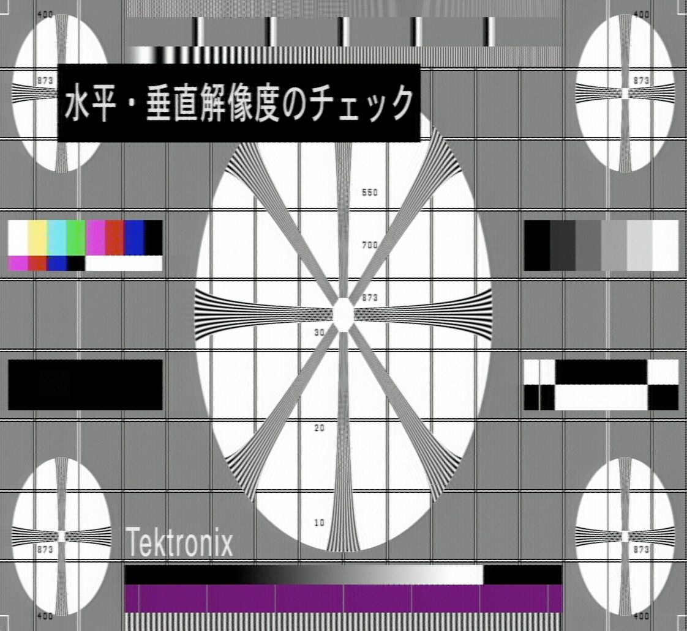

# museld — Real-time MUSE Laserdisc Player

[](https://github.com/staffanu/museld/actions/workflows/ci.yml)

This repository contains a real-time decoder for Hi-Vision MUSE and NTSC (experimental support)
laserdiscs, along with a reusable library and CLI for decoding AC3-RF surround audio and EFM CD
audio from laserdisc RF captures.

If you want to decode laserdiscs in general,
the [ld-decode project](https://github.com/happycube/ld-decode)
is probably a better place to start, but it doesn't decode MUSE, or
currently, AC3-RF.  For bad captures or damaged discs this EFM decoder
might have better results, but since it's not integrated in the ld-decode
toolchain, try that first.

## Download

Windows and macOS builds are produced by CI and attached to
[releases](https://github.com/staffanu/museld/releases). Each zip contains everything the
programs need to run — unpack it and run them from a terminal. The macOS builds are
universal, running natively on both Apple Silicon and Intel, and need macOS 15 or newer:

| Download | Contains |
|---|---|
| `museld-windows-x86_64.zip`<br>`museld-macos-universal.zip` | The player and the decoder CLI. |
| `museld-windows-x86_64-video-export.zip`<br>`museld-macos-universal-video-export.zip` | The same, plus FFmpeg so that `--write` works. Several times the size. |
| `ac3rf-efm-decode-windows-x86_64.zip`<br>`ac3rf-efm-decode-macos-universal.zip` | The decoder CLI on its own, if you don't want the player. |

museld needs a GPU with Vulkan support and current graphics drivers; on macOS it reaches
the GPU through the bundled MoltenVK. Note that the Windows and macOS builds of museld are
**experimental**: they compile and link, but have had little testing on real machines.
`ac3rf-efm-decode` is in better shape.

Neither download is signed with a paid certificate, so both systems object the first time.
On macOS, clear the quarantine tag once with `xattr -cr <folder>`, or download with `curl`
instead of a browser, which never sets it. On Windows, SmartScreen offers "More info" then
"Run anyway".

Builds of the latest commit (rather than the latest release) can be downloaded from the
artifacts of any green
[CI run](https://github.com/staffanu/museld/actions/workflows/ci.yml); this requires being
signed in to GitHub. On Linux, build from source as described below.

See **[docs/packaging.md](docs/packaging.md)** for what is inside the packages, how CI
builds them, and how to make a release.

## Components

### museld

A real-time [MUSE](https://en.wikipedia.org/wiki/Multiple_sub-Nyquist_sampling_encoding)
and NTSC (experimental support) laserdisc decoder. Video filtering runs on the GPU via Vulkan
and GLSL compute shaders. Audio is output via the bundled [miniaudio](https://miniaud.io/) library.

See **[docs/museld.md](docs/museld.md)** for the full player reference.

### ac3rf-efm-decode

A CLI and reusable C++ library for decoding:
- **EFM**: digital CD audio, using CIRC Reed-Solomon error correction. Works for RF signals from
  Laserdiscs or CD players. DTS on Laserdiscs is also EFM-encoded.
- **AC3-RF**: QPSK-modulated AC3 surround audio at 2.88 MHz carrier, as stored on Laserdiscs.

See **[docs/ac3rf-efm-decode.md](docs/ac3rf-efm-decode.md)** for the CLI reference, and
**[docs/ac3rf-decoding.md](docs/ac3rf-decoding.md)** for a detailed explanation of how AC3-RF
decoding works.

### fl2kmuse

Standalone test signal generator for MUSE signals via an FL2K USB device.
This project has very limited scope and was used to validate from assumptions
about MUSE encoding.

### picostream

Standalone tool for streaming data from a Picoscope 5000-series oscilloscope to a file or FIFO,
from either an analog channel or the digital ports (MSO models). Sample rate, ADC resolution,
voltage range, coupling, channel, and capture length are set with command line options
(see `picostream --help`).
Used to capture MUSE RF in real time for piping directly into museld.
(The current tool I use to capture MUSE RF is [fx3usbadc](https://bitbucket.org/staffanulfberg/fx3usbadc).)

## Building

All components require CMake 3.22+ and a C++23 compiler.

### museld + ac3rf-efm-decode + Python bindings (default)

All three are built by default. Dependencies: Vulkan (a recent SDK, see below), GLFW, FLAC++,
Python 3.8+, pkg-config. Audio output (miniaudio), font rendering (stb_truetype), and the
subtitle font are bundled and need no packages. FFmpeg ≥ 7.1 is optional and enables video
file output (`--write`); with older or no FFmpeg, museld builds without it.

Ubuntu packages:
```bash
sudo apt install cmake pkg-config libvulkan-dev glslc libglfw3-dev libflac++-dev \
    libavcodec-dev libavformat-dev libavutil-dev libswresample-dev libswscale-dev \
    catch2 python3-dev
```

On Ubuntu 24.04 the distro Vulkan headers are too old for museld; instead of
`libvulkan-dev glslc`, install the [LunarG Vulkan SDK](https://vulkan.lunarg.com/sdk/home):

```bash
wget -qO- https://packages.lunarg.com/lunarg-signing-key-pub.asc | sudo tee /etc/apt/trusted.gpg.d/lunarg.asc
sudo wget -qO /etc/apt/sources.list.d/lunarg-vulkan.list \
    "https://packages.lunarg.com/vulkan/lunarg-vulkan-$(lsb_release -cs).list"
sudo apt update && sudo apt install vulkan-sdk
```

macOS (Homebrew):

```bash
brew install glfw vulkan-headers vulkan-loader molten-vk shaderc flac catch2 ffmpeg
```

Windows (MSYS2, UCRT64 environment — museld builds, but runtime is not yet well tested):

```bash
pacman -S mingw-w64-ucrt-x86_64-{gcc,cmake,ninja,pkgconf,flac,catch,vulkan-headers,vulkan-loader,glfw,shaderc}
```

Then build with:

```bash
cmake -DCMAKE_BUILD_TYPE=Release -S player -B player/build-release
cmake --build player/build-release
```

GLSL shaders in `player/src/shaders/` are compiled to SPIR-V by `glslc` at build time.
nanobind (for the Python bindings) is fetched automatically by CMake.

### ac3rf-efm-decode only (minimal dependencies)

Dependencies: FLAC++ (`libflac++`), pkg-config.

```bash
cmake -DCMAKE_BUILD_TYPE=Release -DBUILD_MUSE=OFF -DBUILD_PYTHON=OFF \
    -S player -B player/build-ac3rf
cmake --build player/build-ac3rf

# With AddressSanitizer
cmake -DCMAKE_BUILD_TYPE=Debug -DBUILD_MUSE=OFF -DBUILD_PYTHON=OFF \
    -S player -B player/build-debug
cmake --build player/build-debug
```

### fl2kmuse (standalone, requires libosmo-fl2k)

```bash
cmake -DCMAKE_BUILD_TYPE=Release -S fl2kmuse -B fl2kmuse/build-release
cmake --build fl2kmuse/build-release
```

### picostream (standalone, requires Picoscope SDK at /opt/picoscope)

```bash
cmake -DCMAKE_BUILD_TYPE=Release -S picostream -B picostream/build-release
cmake --build picostream/build-release
```

## Running tests

```bash
cmake -DCMAKE_BUILD_TYPE=Debug -DBUILD_MUSE=OFF -DBUILD_PYTHON=OFF -DBUILD_TESTING=ON \
    -S player -B player/build-debug
cmake --build player/build-debug
cd player/build-debug && ctest -V
```

## Quick start — museld

```console
wget --directory-prefix ../data/muse https://madeye.org/muse-demo/makeup-muse-rf-62.5MHz-nofilter.raw
./player/build-release/src/museld ../data/muse/makeup-muse-rf-62.5MHz-nofilter.raw
```



## Author and License

Software written by Staffan Ulfberg 2021–2026.

Licensed under the [GNU General Public License](gpl-3.0.txt), version 3 or (at your option) any later version.
