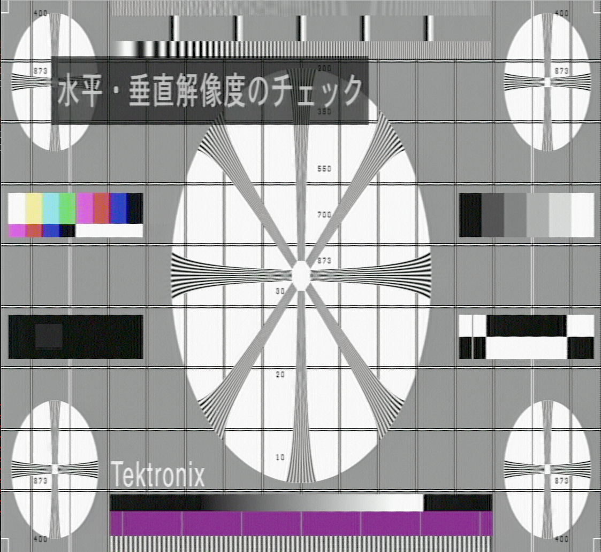

## CPU/GPU Real-time MUSE Decoder

This C++ project contains a complete MUSE decoder that decodes MUSE video in real-time.  I've developed the
software on a Lenovo Carbon X1 Gen 9 (Intel Core i7-1185G7, 3.0 GHz, 4 cores, integrated graphics), and
tested that it works and on a MacBook Pro with an M2 processor, and also on an older Intel iMac.

I tried running it on an NVIDIA Jetson Nano and also on the Raspberry Pi 5, but performance was much worse
than I hoped for in both cases.
For both these targets some code changes are needed due to some unsupported Vulkan features, and those changes
have not been merged to the main branch.

The code is mostly written in C++, with video filtering done by the GPU, using Vulkan and GLSL.

The project uses cmake, and the following commands should build the project on Ubuntu.  This also installs most
of the dependencies, but you also require a C++ compiler, and I didn't want to pick one for you.  g++ or clang should
both work.  You also need a graphics driver that supports Vulkan.

```console
sudo apt install cmake glslc portaudio19-dev libavformat-dev libavcodec-dev libswscale-dev catch2 vulkan-tools vulkan-validationlayers-dev
git clone https://bitbucket.org/staffanulfberg/ldaudio.git
cd ldaudio/musecpp
cmake -DCMAKE_BUILD_TYPE=Release -B build-release .
cmake --build build-release
```

To run the program, see command line options below, but for a quick start download an example RF capture and play it:
```console
wget --directory-prefix ../data/muse https://madeye.org/muse-demo/makeup-muse-rf-62.5MHz-nofilter.raw
./build-release/musecpp --demodulate ../data/muse https://madeye.org/muse-demo/makeup-muse-rf-62.5MHz-nofilter.raw
```



### Command line options

The command line options aren't very well organized and have accumulated over time:

> --big-endian
> --little-endian
> --resample-bytes
> --resample-shorts

Determines the input format; these can not be combined and the names should probably change, possibly
when making them more generic and/or refactoring into several independent options.

* --big-endian / -little-endian: inputs are unsigned shorts sampled at the correct phase at 16.2MHz, with only the 10 least significant bits used.
* --resample-bytes: inputs are samples at a higher frequency (specified by its own parameter) as unsigned bytes.
* --resample-shorts: inputs are samples at a higher frequency (specified by its own parameter) as full 16-bit signed little endian shorts.

I used the --big-endian format initially since I built a 10 bit phase correct sampler using an FPGA.  This is also the
format used by the scala tools.  For some reason I later switched to the little endian format, but still have some
files that are big endian.  I would recommend to stop using big endian files since support might be removed in the future.

The oversampled formats are used when reading data directly from, e.g., a USB oscilloscope, or,
of course, from files containing the corresponding data.

Notice that the input used by these options is baseband, i.e., demodulated output as it is presented on the
output from a MUSE player.

Files in little endian 16.2 MHz format are of course smaller than raw captures.

> --sample-freq

Sets the sample frequency for the oversampled input formats.

> --demodulate

Use this for RF input, i.e., if the signal comes directly from the optical pickup of a modified MUSE player.
The sampling frequency is fixed at 62.5 MHz, and changing this requires re-computation of the filters
used for demodulation.  At some point this could be done dynamically in code but support for demodulation of RF signals is
relatively new.  This now works well if reading from a digital USB oscilloscope.  The input is assumed to consist of
16 bit unsigned ints.

> --no-dropout
> --highlight-dropout

Affects dropout processing when demodulating an RF signal.  The default is to correct dropouts by taking data from the
surrounding picture area.  This can also be changed during playback by pressing the D key.

> --efm

If demodulating an RF signal, this uses the EFM data for audio, instead of decoding MUSE audio.  This can also be changed during
playback by pressing the A key.

> --write-muse <filename>

Writes the input stream in the --little-endian format.  This is useful for creating small video segments from larger
files, and also to re-code captures from one of the oversampled or RF formats.  Notice that in the case of RF, the
EFM data is lost.

> --write <filename>

Writes the decoded video into a media file.  This uses the Ffmpeg libraries and is currently very experimental:
for one, video and audio is not properly synchronized.

> --fifo

Indicates that the input file is really a FIFO (created using the mkfifo command).  Normally, video is played
back at 30 frames/second (60 fields per second).  When reading from a FIFO, however, it is assumed that data is
being produced in real-time (e.g., by some other program reading from a digital USB oscilloscope), which means that
the input data rate matters.  The program then tries to adjust the playback speed to the incoming data rate,
which means that if data is not available it has to wait (instead of assuming end of file),
and if the input buffer fills up a field is dropped.  This also increases the OS default FIFO buffer size.

> --no-video --no-audio

Turns off video and audio output respectively. Useful for troubleshooting (if, for example, the program
doesn't recognize the audio playback device), and also when using the --write option to recode the input
stream; since no decoding has to be done this is faster.

> --no-sync

Frames are displayed as quickly as possible after decoding, without waiting for the next vertical sync. 
Good for benchmarking.

> --full-frames-only --all-fields

Normally, the picture is updated after each field, i.e., 60 times per second.  Specifying --full-frames-only
skips updating every other field, which reduces decoding time at the expense of motion detail.  Try this if
the hardware is too slow for real-time decoding.

> --full-screen
> --seek <seconds>
> --pause

These options affect the initial appearance of the video. 

> --log <log level specification>

Affects the amount of logging produced.  The log levels are specified as a string with a letter indicating the log category,
and a number 0-4 the amount of logging to produce.  The categories are: (M)ain, (P)erformance, (A)udio, (V)ideo, (D)ecoder,
(I)nput, and (O)utput.  The levels 0-4 correspond to Off, Error, Warning, Info, and Debug.  For example "--log A3V4" sets
the Audio category logging level to Info, and the Video category level to Debug.  The default is Warn(2) for all categories.

> --benchmark-shaders
> --help

Auxiliary options.

> filename

Any other option (not starting with ! or -) is interpreted as the name of a file to play back. Several files can be listed
that are played one by one, and other options can appear between the video files.  Each file is played back with the
most recent options in effect.  So, for example, it is possible to play back two files with different input formats
back to back.

Any option starting with ! is ignored, which is practical if re-using long command lines to temporarily disable options.

### Video player user input

When running, the following keys control playback:

> GLFW_KEY_Q, GLFW_KEY_ESCAPE

Quits the application.

> GLFW_KEY_TAB

Toggles between full screen mode and windowed mode.

> GLFW_KEY_SPACE, GLFW_KEY_N

Space toggles between paused and normal play, N steps one frame forward when paused.

> GLFW_KEY_LEFT, GLFW_KEY_RIGHT

Seeks 10 seconds backwards and forwards, respectively.

> GLFW_KEY_1, GLFW_KEY_2, GLFW_KEY_3

Switches how frame interpolation is done:
* 1: Normal, i.e., motion detection is performed to decide what portions of video are in motion and stationary, respectively.
* 2: Force intra-field interpolation, i.e., forces decoding as if everything is in motion.
* 3: Force inter-frame interpolation, i.e., forces decoding as if there is a still picture.

> GLFW_KEY_D

Switches what is done with detected dropouts if demodulating an RF signal.  The choices are to 1) try to conceal the
dropouts, 2) do nothing, and 3) highlight the dropout by using a red or green line covering the dropout.  The color
of the line depends on whether the dropout occurred during the luminance or color part of the input.

> GLFW_KEY_A

Switches the audio processing mode between MUSE and EFM.  Only useful if demodulating an RF signal.

> GLFW_KEY_C

Turns on the mouse cursor and displays its coordinates in the top left of the window.  Two sets of coordinates are shown:
the coordinates in a single field (low resolution: 374x516), and the coordinates in the decoded MUSE output picture (1122x1032).
If intra-frame interpolation is forced (by pressing the 2 key), a calculated input file offset of the pixel under the cursor is also
shown.  This is useful when working with improving dropout detection, in order to find the dropout in the input RF file.
This offset seems to be off by about 1000 samples or so for reasons I've not been able to figure out, and also it is very difficult
to know exactly what pixel is under the cursor.  Anyway, the offset shown is usually close enough that it is easy to find
the dropout in the input file.  There are actually five offsets shown:  In offset of the current frame, the offset of the
current field (start of the sound data, i.e., the third line of the field), and the pixel offset in the Y, Cr, anf Cb data.

The text displayed can be copied to the clipboard by pressing print screen.

> GLFW_KEY_L

Toggles the non-linear processing that is part of de-emphasis on/off.  The reason this can be changed is that I still do not
know if the non-linear processing has already been applied or not in the case we read the input from the output of a MUSE player.
When demodulating RF, enabling the non-linear processing clearly improves picture quality, and we also know that it is not
done elsewhere.  In the other case, however, it is not clear that picture quality is improved, so this is still an unknown.

### Things to do

There are still some features that are not implemented, and also some research on the MUSE format that remains:

> Motion vector handling

In MUSE, still pictures have more detail than do moving parts of the video.  In all documents describing MUSE,
it is mentioned that motion compensation is used in the case of linear motion, such as pans, so that the picture 
can be processed like a still image by translating the previous fields before combining several fields into one.
The motion vector is, supposedly, part of the control data that is transmitted with each field.

The decoder does decode the control data (32 bits in total), and some parts of it, such as the field and frame sub-sampling 
phases are correctly decoded (this is obvious since decoding them incorrectly yields very bad picture quality).  However, the
part of the control data containing the motion vector (3 + 4 bits) is always zero for the discs that I have.  So the question
is if this feature was never actually used for MUSE laserdiscs, or if the specification somehow changed so that this data is 
encoded elsewhere.  I've looked quite extensively at the control signal and concluded that the other bits do not contain
this information either, since it is mostly constant.

> Audio channel mapping

I'm using the Portaudio library to output audio.  For four-channel (mode A) MUSE audio the channels aren't mapped correctly,
and I don't understand if it is possible to query the library which channel is which.  The short term plan is to make it right on
my laptop, but I suspect the channel indices might differ depending on audio hardware.

> Adjustable RF input sample rate

When demodulating RF, the sample rate is currently fixed at 62.5 MHz.  The filters are hard coded in the application and
need to be recalculated if the sample rate changes.  This is not very difficult but remains to be done.  The EFM input filter
is a bit different, in that the current filter has been optimized overnight using octave.  One could still do some optimizations
in runtime, but we would probably have to live with a slightly higher bit error rate for EFM.

> Reading directly from USB

Currently, all input is from file.  For real-time input, the program is dependent on an external program writing to a
fifo (named pipe).  It would be nice to integrate code for reading from some specific devices.

> Non-linear processing

As is mentioned in the description of the L key, I'm not sure if non-linear processing (part of de-emphasis) has already
been applied to the signal when reading from the output of a MUSE player.

> Picture filter improvements

Most of the filters used were computed early in the project, and I was more interested in getting something reasonable
working that spending too much time optimizing the filters used.  Picture quality could probably be improved by spending
more time on these filters.

> Motion detection

The motion detection algorithm is quite simplistic and could probably be improved.

> Adaptive equalization

The MUSE signal is very sensitive to the channel characteristics, and especially phase shifts are bad.  Initially, for RF
captures, I tried to use a lowpass filter before sampling the signal to remove any noise over the Nyquist frequency, 
but results are much better without any analog input filter at all, at least compared to the filter that I used, that
distorted the phase of the signal too much.  Adaptive equalization could be used to mitigate such effects, and
the book by Yuichi Ninomiya (see the list below) described how to do this in Chapter 4.12.  I've not spent any serious
time trying to understand this in detail, however.

### Information on MUSE

The information on MUSE that is available is quite sparse, and some of it is out of date.  Of course, it is all out of date
in some sense of the word, but apparently some details were changed after some of these articles and books were published.

* MUSE－ハイビジョン伝送方式 (MUSE-High-Vision Transmission System), Yuichi Ninomiya, 1990. 
  In Japanese; I managed to get a used copy from amazon.co.jp.
* [High Definition Television Hi Vision Technology](https://archive.org/details/high-definition-television-hi-vision-technology),
  NHK Science and Technical Research Laboratories, 1993.
* An HDTV Broadcasting System Utilizing a Bandwidth Compression Technique-MUSE, Seiichi Gohshi, 1988. 
  In this article the mapping table from audio ternary symbols to bits is incorrect -- I assume they changed it after publication.
* MUSE system for HDTV broadcasting-satellite services, ITU-R BO.786, 1992.
* A method of moving area-detection technique in a muse decoder, Yoshinori Izumi, Seiichi Gohshi, Yuichi Ninomiya, 1993.
